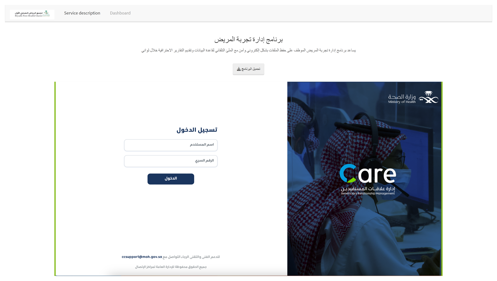
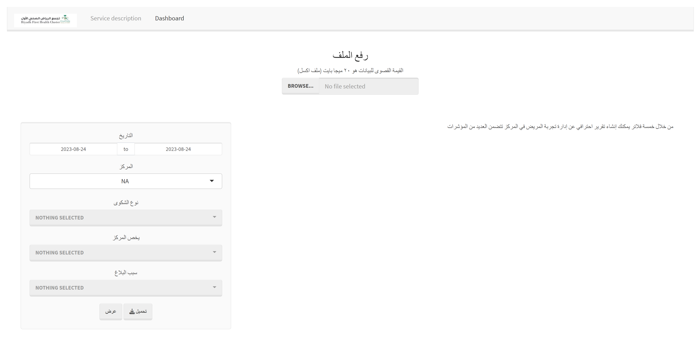
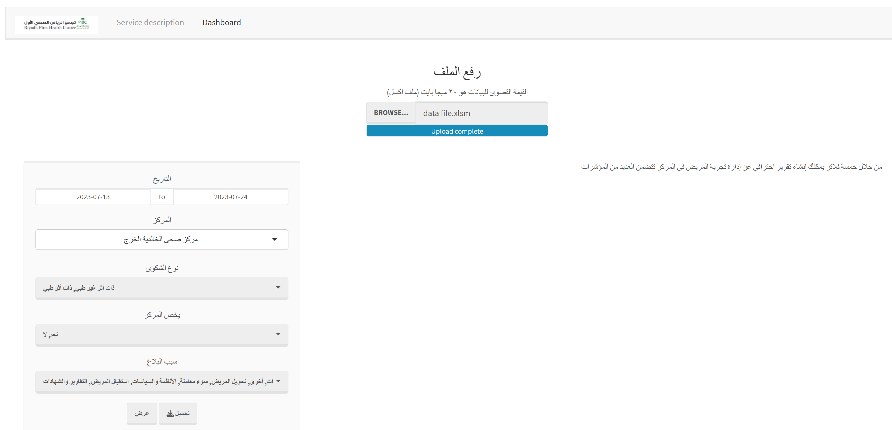
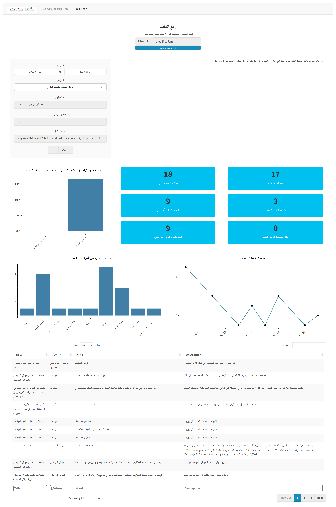

# Citation
> abdullah shalaan. (2030, July 24). Patient experience dashboard. [Shinyapps](https://abdullah-hr.shinyapps.io/Patient-experience/).

# Project title
> Patient experience dashboard

# Content

  <a href="#dashboard-description">Dashboard Description</a>
  
  <a href="#how-to-use-dashboard">How to use dashboard</a>

## Dashboard Description
The patient experience dashboard is made to help the employee save data files in a secure and automatic way, and provide as an output professional data analysis reports. The aim of the dashboard is to allow the employee to monitor the changes in the numbers of reports received by the center, through five data filters, in order to help processing and solving them.

## How to use dashboard

### 1. Download Data Program
We provide with the dashboard a VBA program that is linked to a database of reports and patients experiences. The program organizes the data into an easy to read format that shows reports history and related data.

This program is needed to run the patient experience dashboard.

The program can be downloaded by clicking on the download button **تحميل البرنامج** in the first tab **Service description**.

### 2. Upload Data
The dashboard uses the data from the filled xlsm file included in the program downloaded previously. This file should be uploaded using the upload button in the **Dashboard** tab.

After uploading the data file, the filters are updated accordingly.

The dashboard is manipulated by 5 filters: the date, the center, report type, concerning center, report reason.
After selecting the desired filters combination, the dashboard can be generated by clicking on the **عرض** button.

